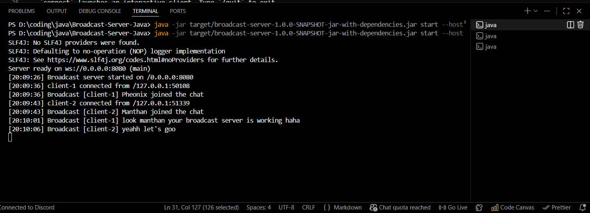
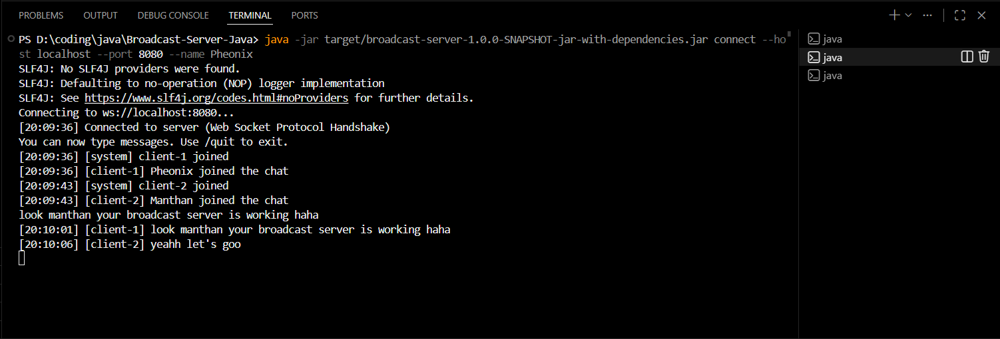
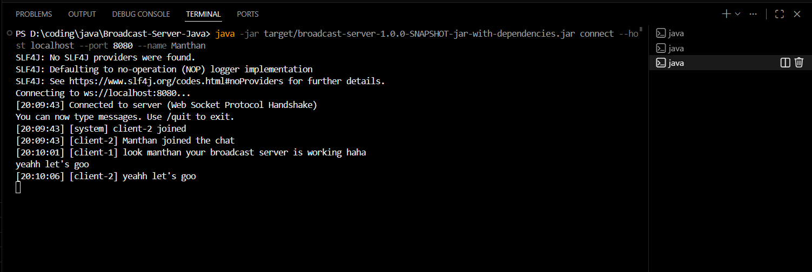

# Broadcast Server CLI

Simple Java 17 CLI that can either start a WebSocket broadcast server or connect to it as a client. It is intended as a minimal reference for real-time communication workflows (chat, dashboards, etc.).

---

### Prerequisites

- Java 17+
- Maven 3.8+

### Build

```sh
mvn package
```

This produces `target/broadcast-server-1.0.0-SNAPSHOT-jar-with-dependencies.jar`.

### How to run

**Start the server**
```sh
java -jar target/broadcast-server-1.0.0-SNAPSHOT-jar-with-dependencies.jar start --host 0.0.0.0 --port 8080
```

**Connect a client**
```sh
java -jar target/broadcast-server-1.0.0-SNAPSHOT-jar-with-dependencies.jar connect --host localhost --port 8080 --name Pheonix
```

- `start` spins up the WebSocket server listening for new clients.
- `connect` launches an interactive client. Type `/quit` to exit.

### Key code details

- `BroadcastServer` wraps Java-WebSocket’s `WebSocketServer` to manage client sessions, broadcast payloads, and announce lifecycle events.
- `BroadcastClient` is a minimal WebSocket client forwarding all server messages to stdout.
- Picocli powers the CLI (`start`, `connect`) in `com.example.broadcast.cli`.

---

## Project Report *(Comprehensive documentation including approach, implementation, results, and analysis)*

### Description*
Explain your implementation approach and key learnings here. Suggested outline:
1. **Approach:** summarise how the server and client were structured, any architectural choices, and libraries used.
2. **Implementation:** highlight noteworthy classes/methods, concurrency handling, and CLI UX considerations.
3. **Results:** describe test scenarios (e.g., multiple clients broadcasting simultaneously) and observed behaviour.
4. **Analysis & Learnings:** capture challenges, trade-offs (e.g., choosing Java-WebSocket), and ideas for future enhancements (auth, history, persistence, GUI).

---

## Notes

- Messages sent by any client are relayed to all other connected clients.
- Connection/disconnection events are announced as `[system]` messages.
- The server assigns auto-incrementing client IDs for clarity.

---

## Screenshots / Evidence

- 
- 
- 


